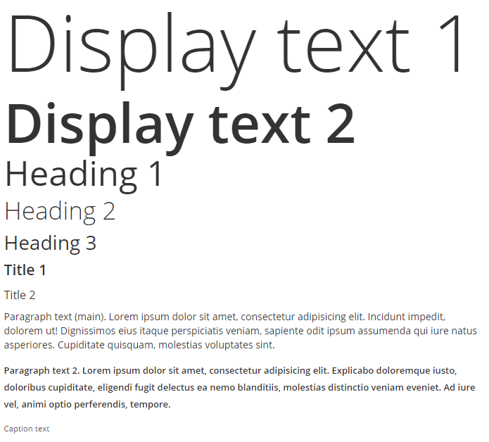
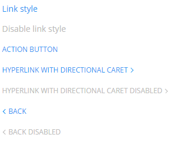
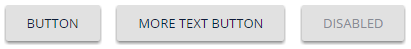
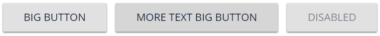

# SEP guidelines
Description text here.

## Contents
* [Typography](#typography)
* [Links](#links)
* [Buttons](#buttons)

## Typography

```
<div class="display1">Display text 1</div>
<div class="display2">Display text 2</div>
<h1>Heading 1</h1>
<h2>Heading 2</h2>
<h3>Heading 3</h3>
<h4>Title 1</h4>
<h5>Title 2</h5>
<p>Paragraph text (main). ...</p>
<p class="p2">Paragraph text 2. ...</p>
<p class="caption">Caption text</p>
```
Instead of tags you can use classes:
```
<p class="h1">Heading 1</p>
<p class="h2">Heading 2</p>
<p class="h3">Heading 3</p>
<p class="t1">Title 1</p>
<p class="t2">Title 2</p>
```

## Links

```
<a href="#">Link style</a>
<a class="link-disabled" href="#">Disable link style</a>
<a class="action" href="#">Action button</a>
<a class="action action-next" href="#">Hyperlink with Directional Caret</a>
<a class="action action-next action-disabled" href="#">Hyperlink with Directional Caret Disabled</a>
<a class="action action-prev" href="#">Back</a>
<a class="action action-prev action-disabled" href="#">Back Disabled</a>
```
Also you can use class `link`.
```
<span class="link" onclick="...">Link style</span>
```

## Buttons

```
<button>Button</button>
<button>More text Button</button>
<button class="button-disabled">Disabled</button>
```
You also can use class `button`.
```
<div class="button">Button</div>
<div class="button button-disabled">Disabled</div>
```
For big buttons use `button-bg` class.

```
<button class="button-bg">Big Button</button>
<button class="button-bg">More text Big Button</button>
<button class="button-bg button-disabled">Disabled</button>
```
